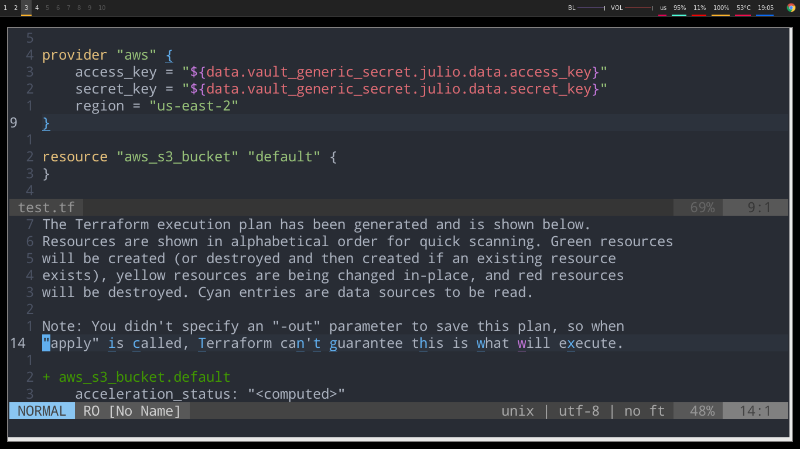

# Changelog
## **Disclamier:** Have to mostly use asciinema due to my laptop take foerever to do gifs

## 2018-04-20
- Added Evaluation of Interpolation

## 2018-02-23
- Added Resource/Data interpolation from other files

## 2018-01-18
- Added version based completion
- Added Bots for auto update for provider(daily check)
- Fix several bugs relating to attribute subcompletion

## 2017-12-06
- Nested Block Completion

## 2017-11-23 
- Terraform Module Registry Name Completion

## 2017-11-22 
- Terraform Module Registry support

## 2017-05-22 
### New Feature
- Deoplete Support

- Open Doc in a browser(need to make sure windows and mac work), key is `<leader>o`

## 2017-05-20
### New Feature
- Lookup Attribute Data
- If you have terraform.tfstate in your folder, then using `<leader>a` can show the data of the attribute

## 2017-05-20
### Improvement
- Plan have color now

## 2017-05-18
### New Feature
- Run(`<leader>rr`) and Fold Output

- Run as Async Job

### Improvement
- Module completion for subpath of github/bitbucket

## 2017-05-15
### Remove
- Version based completion is remove due to load time, storage, and the docs are inconsistent
### Improvement
- All data and resources arguments have type with it now
- Block completion is complete , thanks to data from [VladRassokhin](https://github.com/VladRassokhin/)

## 2017-05-14
### New Features
- Basic Block Completion
- Functions Completion
- Added Basic Resource Arguments
### Improvement
- Much better attribute completion

## 2017-05-09(5 am)
### New Feature
- Support for Neomake
## 2017-05-09(3 am)

### New Feature
- Show docs for data/resource attribute
## 2017-05-08(10 pm)
### New Feature
- Module Attribute completion(Github online, and offline
### Improvement
- Fix data interpolation from ${[name]} to ${data.[name]}
- Fix module relative lookup(now it will look in the same folder as the editing tf file)
- Fine tune some provider scrapping, where name include in the resource link(like opc)

## 2017-05-08(6 am)
### New Feature
- Moudle GitHub Argument Completion(Working on offline and attribute completion
    for module)

## 2017-05-08(4 am)
### New Feature
- Show Docs

## 2017-05-06(3 pm)
### New Feature
- Version based Completion

## 2017-05-06(5 am)
### New Feature
- Jump Reference for Resource/Data

## 2017-05-06(2 am)
### New Feature
- Data Completion

## 2017-05-04(3 am)
### Improvement
- Added Tagbar config for Terraform
## 2017-05-03(Night)
### Improvement for Repo
- Added Travis and added basic test using vader.vim

## 2017-05-03(Afternoon)
### Improvement
- Now resource completion have provider as well

### New Feature
- New custom linter to filter `terraform validate` and `terraform plan` using to provide line number and error message for syntastic
    - introduce `g:syntastic_terraform_tf_filter` variable in vimrc for enabling terraform plan , default is 0

## 2017-05-03(Morning 2-4 AM)
### Improvement
- Interpolation of parameter completion is much better now

    
### New Feature
- There is variable completion now, it will get the root folder level variables.tf
- NOTE: There is still to be fix dealing with function like ${file()} etc

    
