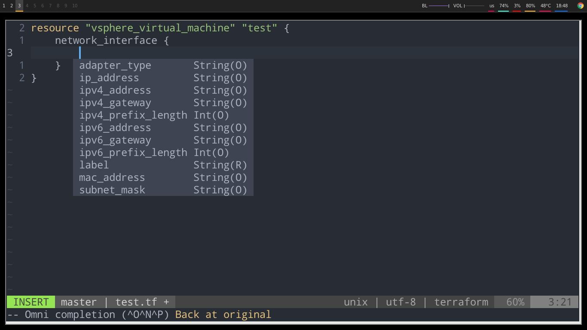

# (Neo)Vim Terraform Completion with Linter - [Demos](./DEMO.md)

**IMPORTANT: This plugin now allow version based completion**

## [Changelog](./CHANGELOG.md)

## [Provider Versions](./PROVIDER_VERSIONS.md)

## [Community Provider Versions](./COMMUNITY_PROVIDER_VERSIONS.md)

[](https://travis-ci.org/juliosueiras/vim-terraform-completion)
[](https://travis-ci.org/juliosueiras/vim-terraform-completion)

[](https://gitter.im/juliosueiras/vim-terraform-completion?utm_source=badge&utm_medium=badge&utm_campaign=pr-badge&utm_content=badge)
[](https://app.fossa.io/projects/git%2Bgithub.com%2Fjuliosueiras%2Fvim-terraform-completion?ref=badge_shield)

**Terraform Module is supported(though there might be bugs)**


## Overview

[](https://asciinema.org/a/119610)

- [Vim Terraform Completion with Linter - Demos](#vim-terraform-completion-with-linter---demosdemomd)
  * [Changelog](#changelog)
  * [Dependencies](#dependencies)
  * [Installation](#installation)
    + [NeoBundle](#neobundle)
    + [Vim-Plug](#vim-plug)
    + [Minimal Configuration](#minimal-configuration)
    + [Deoplete config](#deoplete-config)
    + [Version config](#version-config-file)
    + [Custom Provider](./CUSTOM_PROVIDER.md)
		- [Community Providers](#community-providers)
	- [Specific Providers Config](#specific-providers)
  * [General Todo](#general-todo)
  * [Todo for Terraform completion](#todo-for-terraform-completion)
  * [Todo for HCL](#todo-for-hcl)
  * [Todo for Improvement](#todo-for-improvement)
  * [Credits](#credits)
  * [Contributors](#contributors)

### Block Completions
(R) for Require , (O) for Optional and (B) for Block




## Dependencies

- [vim-terraform](https://github.com/hashivim/vim-terraform) (For FileType)
  (Optional not require for completion)
- [vim-syntastic](https://github.com/vim-syntastic/syntastic) (Only for Linter)
- [neomake](https://github.com/neomake/neomake) (Only for Linter, Neovim)
- [Deoplete](https://github.com/Shougo/deoplete.nvim) (Neovim only, for completion)
- Ctags & [tagbar](https://github.com/majutsushi/tagbar) (Optional for Tag Sidebar)

## Installation

**Require `+ruby` or `+ruby/dyn` for vim & json gem for ruby as well**

Snippets completion is done through `<C-X><C-K>`

### NeoBundle
```vim
NeoBundle 'hashivim/vim-terraform'
NeoBundle 'vim-syntastic/syntastic'
NeoBundle 'juliosueiras/vim-terraform-completion'
```

### Vim-Plug
```vim
Plug 'hashivim/vim-terraform'
Plug 'vim-syntastic/syntastic'
Plug 'juliosueiras/vim-terraform-completion'
```

### Minimal Configuration
```vim
" Minimal Configuration
set nocompatible
syntax on
filetype plugin indent on

call plug#begin('~/.vim/plugged')

" (Optinal) for Tag Sidebar
" Plug 'majutsushi/tagbar'

Plug 'hashivim/vim-terraform'
Plug 'vim-syntastic/syntastic'
Plug 'juliosueiras/vim-terraform-completion'
call plug#end()

" Syntastic Config
set statusline+=%#warningmsg#
set statusline+=%{SyntasticStatuslineFlag()}
set statusline+=%*

let g:syntastic_always_populate_loc_list = 1
let g:syntastic_auto_loc_list = 1
let g:syntastic_check_on_open = 1
let g:syntastic_check_on_wq = 0

" (Optional)Remove Info(Preview) window
set completeopt-=preview

" (Optional)Hide Info(Preview) window after completions
autocmd CursorMovedI * if pumvisible() == 0|pclose|endif
autocmd InsertLeave * if pumvisible() == 0|pclose|endif

" (Optional) Enable terraform plan to be include in filter
let g:syntastic_terraform_tffilter_plan = 1

" (Optional) Default: 0, enable(1)/disable(0) plugin's keymapping
let g:terraform_completion_keys = 1

" (Optional) Default: 1, enable(1)/disable(0) terraform module registry completion
let g:terraform_registry_module_completion = 0
```

## Deoplete config
put this in your init.vim
```vim
let g:deoplete#omni_patterns = {}
let g:deoplete#omni_patterns.terraform = '[^ *\t"{=$]\w*'
let g:deoplete#enable_at_startup = 1
call deoplete#initialize()
```

**NOTE: For newer version of deoplete if the above doesn't work**

```vim

let g:deoplete#omni_patterns = {}

call deoplete#custom#option('omni_patterns', {
\ 'complete_method': 'omnifunc',
\ 'terraform': '[^ *\t"{=$]\w*',
\})

call deoplete#initialize()
```


## Version config file
by default , all providers uses the latest version, but you can add a file call `.tfcompleterc` under working directory, and content can be this:
```
vsphere=1.0.3
aws=0.1.0
```

using the syatax of `<provider>=<version>`

*Demo:*
[](https://asciinema.org/a/157636)

## Community Providers

By default no community providers is enable, to use one, first refer to COMMUNITY_PROVIDER_VERSIONS.md , then add a `.tfcompleterc` to your current working dir , for ex. to use Generic REST Api Provider, the .tfcompleterc would look like

```
restapi=master
```

## Specific Providers

### Google Beta Provider

To use completion for google beta provider, please use `.tfcompleterc` and put `google=beta_<version>`

## General Todo
<details>
<summary>Todolist</summary>

- [X] Adapt to Upcoming terraform 0.10
- [X] Added a bot for auto pushing of new provider version 
- [ ] (WIP) Refactoring Regex for linter and completion, and Trying out on api based(so it can integrade with other editor) solution
- [ ] (WIP) More test cases
- [x] Support for Neomake(Require further testing)
- [X] Run terraform plan and output to a new window(`<leader>rr`) 
- [X] Async Run support(For Neovim/Vim 8) 
- [ ] Move regex code to a json(for easier extension)
- [x] Test from zero to useful setup using Docker
- [x] Jump Reference (Ctrl-L first time to jump to resource definition, second time
    on the same line to jump back)
- [x] Show Doc (Ctrl-K)
- [x] Provide config and example
- [x] Integrate Basic `terraform validate` and `tflint` into Synstatic
- [x] Added a custom linter for providing a better error
- [ ] (WIP) Better linter
- [ ] (WIP) Full Snippets
</details>

**NOTE:** enabling deep check for tflint can be a bit slow

**NOTE:** To use `tffilter` please add `export PATH=$PATH:/path/to/this/plugin/bin` to your bashrc or zshrc

[Demo of the linter](https://asciinema.org/a/118441)

## Todo for Terraform completion
<details>
<summary>Todolist</summary>

- [X] (Require more work) Lookup Attributes data using terraform.tfstate
- [X] Evaluate Interpolation
- [ ] (WIP) Custom Provider completion, might do Rest API style due to unstable custom provider
- [ ] Provider
- [x] Completion for functions(file,etc) and basic resource arguments(count,lifecyle, etc)
- [x] Module (Make sure you run `terraform get` beforehand)
- [x] Data
- [x] Resource(with Provider)
- [x] Parameter
- [x] Adding Info to Argument and Attribute(Type not including ,since Info
    already indicate it)
- [x] Variable
- [ ] Cleaner code
- [x] local/offline
- [x] Add completion tags, ingress, and other subblock
- [ ] Further seperate data source from resource
</details>

## Todo for HCL
- [ ] Add Completion for hcl
- [X] Completion for Sublock(Indicate by `Type(B)` )
## Todo for Improvement
- [X] Add Travis-CI for testing, and ensuring the completion is outputing the right completion
- [X] Look into the new module registry (Now support module name completion)
- [X] Add config for allowing multiple version for providers

## Credits
- Provider Model Extraction script adapted from [Intellij-hcl](https://github.com/VladRassokhin/intellij-hcl)
- Completion data is from Terraform Official Documentation and Model data from [Intellij-HCL](https://github.com/VladRassokhin/intellij-hcl/)
- Folding adapted from [vim-terraform](https://github.com/hashivim/vim-terraform)

## [Contributors](./CONTRIBUTORS.md)


## License
[](https://app.fossa.io/projects/git%2Bgithub.com%2Fjuliosueiras%2Fvim-terraform-completion?ref=badge_large)
